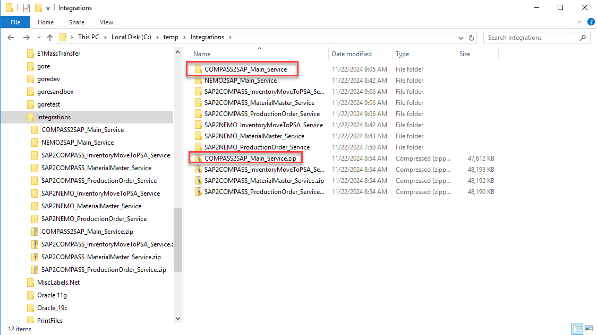
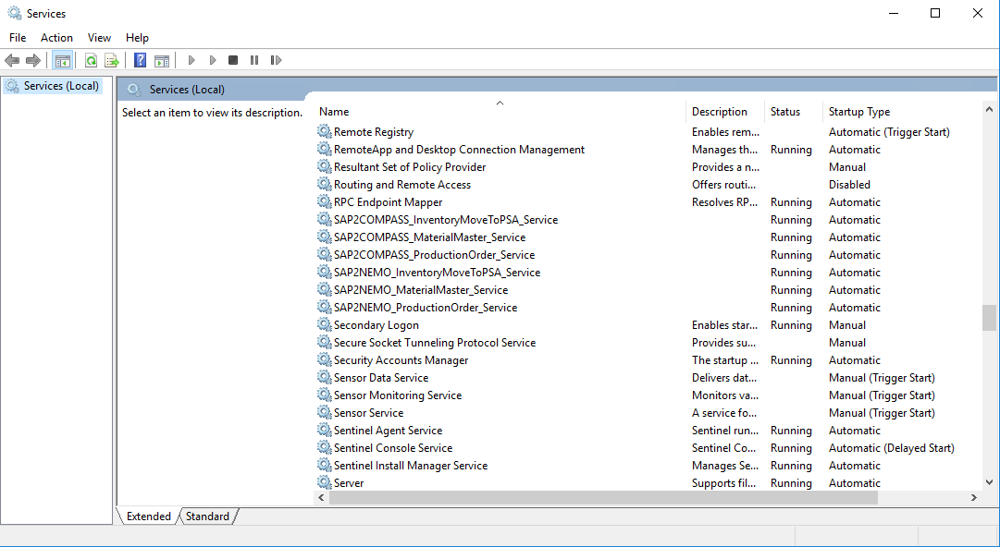
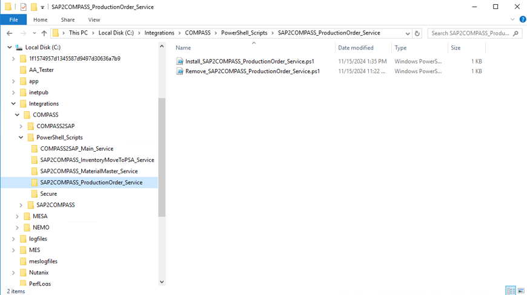
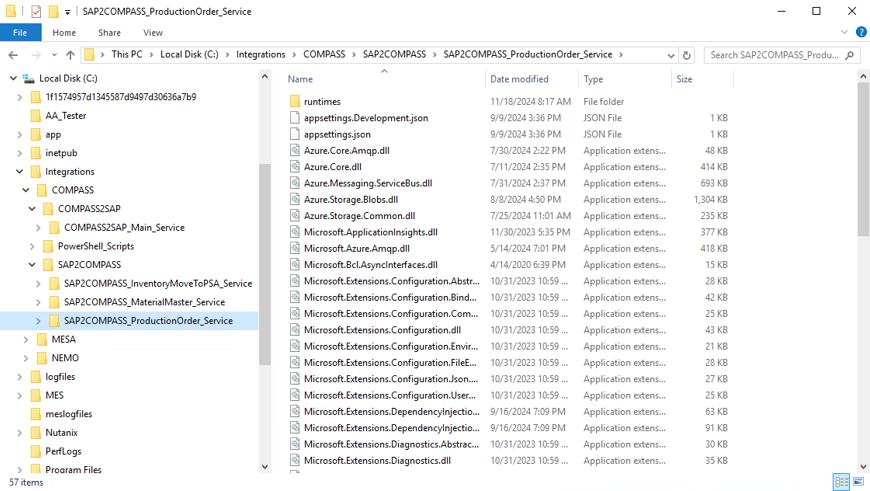
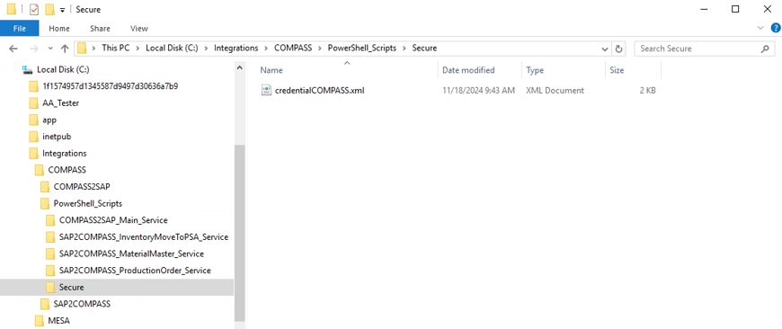

# Azure MES Client Deployment

## Servers

- DEV: USEMESAVL01
- PRD: USEMESALIMSPD02

## Copy the build files to the server

The latest build can be downloaded from here: <https://github.com/goreperformancesolution/sap-compass-azure-integration/actions/workflows/build-mes-azure-client.yaml>.

Download the build artifacts and extract them to this temporary location on the server:

Folder: `C:\temp\Integrations`



> [!IMPORTANT]
> Before performing the remaining steps, make sure the Services window is not open!



## Location of PowerShell deployment scripts

Folder: `C:\Integrations\COMPASS\PowerShell_Scripts`



## Stop and delete the service

Using SAP2COMPASS_ProductionOrder_Service as example, run PowerShell as administrator and run the following command:

```ps1
cd C:\Integrations\COMPASS\PowerShell_Scripts\SAP2COMPASS_ProductionOrder_Service
```

Run the following command to stop and delete SAP2COMPASS_ProductionOrder_Service:

```ps1
.\Remove_SAP2COMPASS_ProductionOrder_Service.ps1
```

## Location of Azure MES client installation files on server

Folder: `C:\Integrations\COMPASS\SAP2COMPASS`



## Copy the build files from the temporary files folder to the installation files folder

Navigate to the following folder and move all files to the PreviousVersion sub-folder:

`C:\Integrations\COMPASS\SAP2COMPASS\SAP2COMPASS_ProductionOrder_Service`

Copy all files from the temporary files folder...

Folder: `C:\temp\Integrations\SAP2COMPASS_ProductionOrder_Service`

...to the installation files folder:

Folder: `C:\Integrations\COMPASS\SAP2COMPASS\SAP2COMPASS_ProductionOrder_Service`

## Install and start the service

In PowerShell, run the following command to install and start SAP2COMPASS_ProductionOrder_Service:

```ps1
.\Install_SAP2COMPASS_ProductionOrder_Service.ps1
```

The service should now be running on the server!

## Credentials used by the service

Note: The install script starts the service with the credentials stored in a secure XML file at the following location:



The secure XML file can be recreated by running `CreateCOMPASSCredentials.ps1`, located in the `PowerShell_Scripts` folder.
