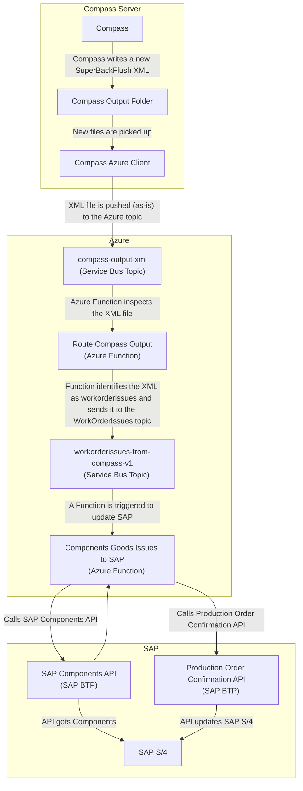

# Components Goods Issues to SAP

Feature spec is [features/components-goods-issues-to-sap.feature](../features/components-goods-issues-to-sap.feature).

This integration relates to _IDD0613 Receive Components Goods Issues_.



## Receive WorkOrderIssues XMLs from Compass

The _Compass Azure Client_ monitors the Compass output folder for new XML files and publishes them to Azure. For more details on this process, see [Route outgoing Compass XMLs](./route-outgoing-compass-xmls.md).

Relevant for this integration are XML files with a `<MessageType>` of `WorkOrderIssues`, which are published to a topic subscription for the `components-goods-issues-to-sap` Function:

- [Topic subscription for the `components-goods-issues-to-sap` Function (DEV)](https://portal.azure.com/#@wlgore.onmicrosoft.com/resource/subscriptions/e2fda199-cfde-4565-9bb3-08b676d05cc2/resourceGroups/rg-arb-406c7858f033cd27c6cf5c3530980ecd50d70417/providers/Microsoft.ServiceBus/namespaces/sbn-uivtxalxpuii2/topics/workorderissues-from-compass-v1/explorer)
- [Topic subscription for the `components-goods-issues-to-sap` Function (VAL)](https://portal.azure.com/#@wlgore.onmicrosoft.com/resource/subscriptions/e2fda199-cfde-4565-9bb3-08b676d05cc2/resourceGroups/rg-arb-6592bc8064206952043ec5110cdc8bf25ff1489b/providers/Microsoft.ServiceBus/namespaces/sbn-k7nqx5nlh6fcs/topics/workorderissues-from-compass-v1/explorer)
- Topic subscription for the `components-goods-issues-to-sap` Function (PRD)

## Azure to SAP

From there, the Azure Function [`components-goods-issues-to-sap`](../function-app/src/functions/compass-to-sap/components-goods-issues-to-sap.ts) consumes the messages.

Following steps are performed:

1. Stop processing if the plant in any `<TxnWrapper>` is not mapped in [plant.csv](../function-app/src/conversions/plant.csv)
1. Throw an error if OrderID and Order Operation are not the same in each `<TxnWrapper>`.
1. Get Production Order Components from the SAP API for the given Production Order id in the xml.
1. Stop processing if no reservation with variable quantity found for the production order.
1. Perform the translation from [components-goods-issues-to-sap.xslx](../features/components-goods-issues-to-sap.xlsx)
1. Invoke the [Production Order Confirmation API](https://api.sap.com/api/OP_API_PROD_ORDER_CONFIRMATIO_2_SRV_0001/path/post_ProdnOrdConf2)
1. Mark the file as completed in the Compass transaction manager

All payloads are stored in Azure, the exact location for each Function invocation is printed in the logs. For more details, see [TROUBLESHOOTING.md](../TROUBLESHOOTING.md#accessing-payloads).

```log
[2024-10-18T12:51:33.794Z] Blob location is topic=components-goods-issues-to-sap/year=2024/month=10/day=18/mid=add70b2688164cddb27d84d9eddc13f8/
```

## Logs

See [TROUBLESHOOTING.md](../TROUBLESHOOTING.md#accessing-the-logs) on how to access the logs.

## Updating the mapping

Follow the steps below to update the mapping from the incoming SAP message to the Compass XML file:

1. Document the change in [components-goods-issues-to-sap.xslx](../features/components-goods-issues-to-sap.xlsx)
1. Add the mapped fields of the incoming `ComponentsGoodsIssuesTxnWrapper` in [route-compass-output.d.ts](../function-app/src/functions/compass-to-sap/route-compass-output.d.ts)

   The `ComponentsGoodsIssuesTxnWrapper` currently only contains the fields that are also currently mapped. You can see the entire SAP message with all available fields in the `input.xml` file(s) in the Azure Blob Container `message-archive` under `topic=components-goods-issues-to-sap`.

1. Update the XML text with the new mapping(s) in the `getRequestBody(...)` method of [components-goods-issues-to-sap.ts](../function-app/src/functions/compass-to-sap/components-goods-issues-to-sap.ts)
1. Update the expected SAP request bodies in [components-goods-issues-to-sap](../function-app/test/compass-to-sap/components-goods-issues-to-sap/)
