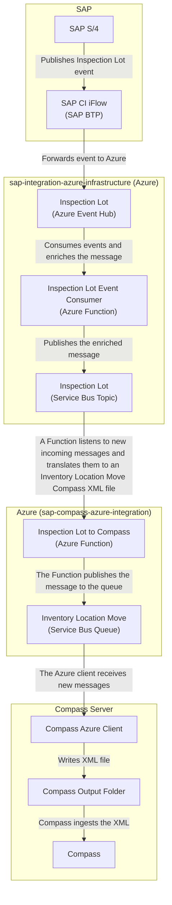

# Inspection Lot to Compass

Feature spec is [features/inspection-lot-to-compass.feature](../features/inspection-lot-to-compass.feature).

This integration relates to _IDD0608 Send Inspection Lot (Incoming, In-process, Post Processing) to Azure-Manufacturing Execution_.



## SAP to Azure

SAP sends the Inspection Lot events to the Azure topic resources provided by [sap-integration-azure-infrastructure](https://github.com/goreperformancesolution/sap-integration-azure-infrastructure). There, the message is enriched with additional SAP fields, e.g. by calling SAP APIs, and published to the Azure Service Bus topic _inspection-lot-v1-topic_. For more details about that part of the process, see [sap-integration-azure-infrastructure](https://github.com/goreperformancesolution/sap-integration-azure-infrastructure).

## Compass-specific logic in Azure

From there, the Azure resources provided by this repository continue processing the message. The Azure Function [_inspection-lot-to-compass.ts_](../function-app/src/functions/inspection-lot-to-compass.ts) listens to messages from Service Bus topic _inspection-lot-v1-topic_ and performs the following steps:

1. Stops processing the message if it is not for a plant that uses Compass, see [function-app/src/conversions/plant.csv](../function-app/src/conversions/plant.csv)
1. Translate the message to an XML following [features/inspection-lot-to-compass.xlsx](../features/inspection-lot-to-compass.xlsx)
1. Upload the XML to the Azure Storage Blob Container
1. Publish a message with a reference to the XMl file in the Azure Storage Blob Container to the Service Bus queue _inventory-location-move-to-compass_

The message in the _inventory-location-move-to-compass_ is then consumed by the _Compass Azure Client_.

All payloads are stored in Azure, the exact location for each Function invocation is printed in the logs. For more details, see [TROUBLESHOOTING.md](../TROUBLESHOOTING.md#accessing-payloads).

```log
[2024-10-18T12:51:33.794Z] Blob location is topic=inspection-lot-to-compass/year=2024/month=10/day=18/mid=add70b2688164cddb27d84d9eddc13f8/
```

## Compass Azure Client

The _Compass Azure Client_ listens to messages from the Service Bus queue _inventory-location-move-to-compass_ and performs the following steps:

1. Download the XML file from the Azure Storage Blob Container
1. Write the XML file in the input folder of Compass

From there, Compass picks up the file and either creates or updates the Inspection Lot record.

## Logs

See [TROUBLESHOOTING.md](../TROUBLESHOOTING.md#accessing-the-logs) on how to access the logs.

## Updating the mapping

Follow the steps below to update the mapping from the incoming SAP message to the Compass XML file:

1. Document the change in [inspection-lot-to-compass.xlsx](../features/inspection-lot-to-compass.xlsx)
1. Add the mapped fields of the incoming `SAPMessage` in [inspection-lot-to-compass.d.ts](../function-app/src/functions/sap-to-compass/inspection-lot-to-compass.d.ts)

   The `SAPMessage` currently only contains the fields that are also currently mapped. You can see the entire SAP message with all available fields in the `input.json` file(s) in the Azure Blob Container `message-archive` under `topic=inspection-lot-to-compass`.

1. Update the XML text with the new mapping(s) in the `createXml(...)` method of [inspection-lot-to-compass.ts](../function-app/src/functions/sap-to-compass/inspection-lot-to-compass.ts)
1. Update the expected test result in [expected.xml](../function-app/test/sap-to-compass/inspection-lot-to-compass/expected.xml)
