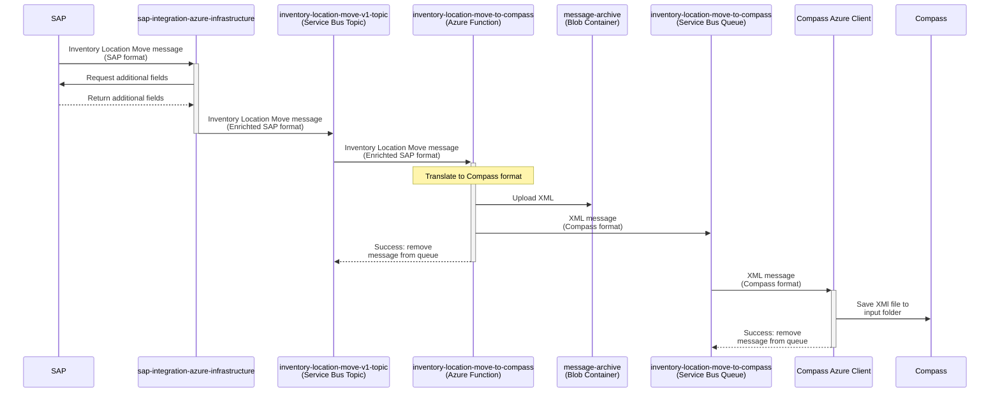

# Inventory Location Move to Compass

Feature spec is [features/inventory-location-move-to-compass.feature](../features/inventory-location-move-to-compass.feature).

This integration relates to _IDD0611 Send Inventory Location Move for Production Staging to Azure-Manufacturing Execution_.



## SAP to Azure

SAP sends the Inventory Location Move message (SAP format) to the Azure resources provided by [sap-integration-azure-infrastructure](https://github.com/goreperformancesolution/sap-integration-azure-infrastructure). There, the message is translated to the Compass XML format, including S4-to-Compass translations for plants, status codes, locations, etc. The translated message is then published to the Azure Service Bus topic _inventory-location-move-v1-topic_. For more details about that part of the process, see [sap-integration-azure-infrastructure](https://github.com/goreperformancesolution/sap-integration-azure-infrastructure).

## Compass-specific logic in Azure

From there, the Azure resources provided by this repository continue processing the message. The Azure Function [_inventory-location-move-to-compass_](../function-app/src/functions/inventory-location-move-to-compass.ts) listens to messages from Service Bus topic _inventory-location-move-v1-topic_ and performs the following steps:

1. Stops processing the message if it is not for a plant that uses Compass, see [function-app/src/conversions/plant.csv](../function-app/src/conversions/plant.csv)
1. Translate the message to an XML used to upsert the Inventory Location Move record from [inventory-location-move-to-compass.xlsx](../features/inventory-location-move-to-compass.xlsx)
1. Upload the XMLs to the Azure Storage Blob Container
1. Publish the XML to the Service Bus queue _inventory-location-move-to-compass_

All payloads are stored in Azure, the exact location for each Function invocation is printed in the logs. For more details, see [TROUBLESHOOTING.md](../TROUBLESHOOTING.md#accessing-payloads).

```log
[2024-10-18T12:51:33.794Z] Blob location is topic=inventory-location-move-to-compass/year=2024/month=10/day=18/mid=add70b2688164cddb27d84d9eddc13f8/
```

The message in the _inventory-location-move-to-compass_ is then consumed by the _Compass Azure Client_.

## Compass Azure Client

The _Compass Azure Client_ listens to messages from the Service Bus queue _inventory-location-move-to-compass_ and writes the XML to the input folder of Compass.

From there, Compass picks up the file and upserts the Inventory Location Move record.

## Logs

See [TROUBLESHOOTING.md](../TROUBLESHOOTING.md#accessing-the-logs) on how to access the logs.

## Updating the mapping

Follow the steps below to update the mapping from the incoming SAP message to the Compass XML file:

1. Document the change in [inventory-location-move-to-compass.xlsx](../features/inventory-location-move-to-compass.xlsx)
1. Add the mapped fields of the incoming `SAPMessage` in [inventory-location-move-to-compass.d.ts](../function-app/src/functions/sap-to-compass/inventory-location-move-to-compass.d.ts)

   The `SAPMessage` currently only contains the fields that are also currently mapped. You can see the entire SAP message with all available fields in the `input.json` file(s) in the Azure Blob Container `message-archive` under `topic=inventory-location-move-to-compass`.

1. Update the XML text with the new mapping(s) in the `createXml(...)` method of [inventory-location-move-to-compass.ts](../function-app/src/functions/sap-to-compass/inventory-location-move-to-compass.ts)
1. Update the expected test results in the [expected-\*.xml](../function-app/test/sap-to-compass/inventory-location-move-to-compass) files
