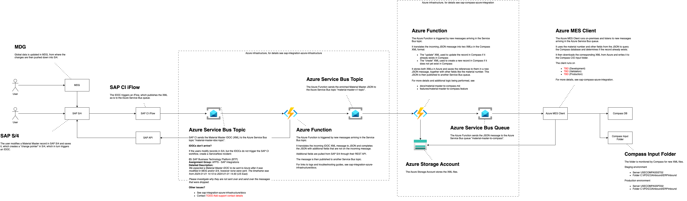

# Material Master to Compass

Feature spec is [features/material-master-to-compass.feature](../features/material-master-to-compass.feature).

The flow diagram [material-master-to-compass.png](./material-master-to-compass.png) file is an editable bitmap image and can be edited using DrawIO.



This integration relates to _IDD0606 Send Material Master to Azure-Manufacturing Execution_.

## SAP to Azure

SAP sends the Material Master message (SAP IDOC format) to the Azure topic resources provided by [sap-integration-azure-infrastructure](https://github.com/goreperformancesolution/sap-integration-azure-infrastructure). There, the message is enriched with additional SAP fields, e.g. by calling SAP APIs, and published to the Azure Service Bus topic _material-master-v1-topic_. For more details about that part of the process, see [sap-integration-azure-infrastructure](https://github.com/goreperformancesolution/sap-integration-azure-infrastructure).

## Compass-specific logic in Azure

From there, the Azure resources provided by this repository continue processing the message. The Azure Function [_material-master-to-compass.ts_](../function-app/src/functions/sap-to-compass/material-master-to-compass.ts) listens to messages from Service Bus topic _material-master-v1-topic_ and performs the following steps:

1. Stops processing the message if the material is not MES relevant, see [is-material-mes-relevant.ts](../function-app/src/functions/is-material-mes-relevant.ts)
1. Stops processing the message if it is not for a plant that uses Compass, see [plant.csv](../function-app/src/conversions/plant.csv)
1. Translate the message to an XML used to create new Material Master records
1. Translate the message to an XML used to update existing Material Master records
1. Upload both XMLs to the Azure Storage Blob Container
1. Publish a message to the Service Bus queue _material-master-to-compass_

The mapping from the incoming message to the XML is documented in [features/material-master-to-compass.xlsx](../features/material-master-to-compass.xlsx).

The message to the _material-master-to-compass_ queue contains references to both XML files in the Azure Storage Blob Container and some Material Master fields, which are used by the _Compass Azure Client_ to see if the Material Master record already exists in Compass.

All payloads are stored in Azure, the exact location for each Function invocation is printed in the logs. For more details, see [TROUBLESHOOTING.md](../TROUBLESHOOTING.md#accessing-payloads).

```log
[2024-10-18T12:51:33.794Z] Blob location is topic=material-master-to-compass/year=2024/month=10/day=18/mid=add70b2688164cddb27d84d9eddc13f8/
```

## Compass Azure Client

The _Compass Azure Client_ listens to messages from the Service Bus queue _material-master-to-compass_ and performs the following steps:

1. Query the Compass database if the Material Master already exists
1. Download the corresponding XML file from the Azure Storage Blob Container
1. Place the XML file in the input folder of Compass

From there, Compass picks up the file and either creates or updates the Material Master record.

## Logs

See [TROUBLESHOOTING.md](../TROUBLESHOOTING.md#accessing-the-logs) on how to access the logs.

## Updating the mapping

Follow the steps below to update the mapping from the incoming SAP message to the Compass XML file:

1. Document the change in [material-master-to-compass.xlsx](../features/material-master-to-compass.xlsx)
1. Add the mapped fields of the incoming `SAPMessage` in [material-master-to-compass.d.ts](../function-app/src/functions/sap-to-compass/material-master-to-compass.d.ts)

   The `SAPMessage` currently only contains the fields that are also currently mapped. You can see the entire SAP message with all available fields in the `input.json` file(s) in the Azure Blob Container `message-archive` under `topic=material-master-to-compass`.

1. Update the XML text with the new mapping(s) in the `createCreateXml(...)` method of [material-master-to-compass.ts](../function-app/src/functions/sap-to-compass/material-master-to-compass.ts)
1. Update the XML text with the new mapping(s) in the `createUpdateXml(...)` method of [material-master-to-compass.ts](../function-app/src/functions/sap-to-compass/material-master-to-compass.ts)
1. Update the expected test results in the [expected-\*.xml](../function-app/test/sap-to-compass/material-master-to-compass) files
