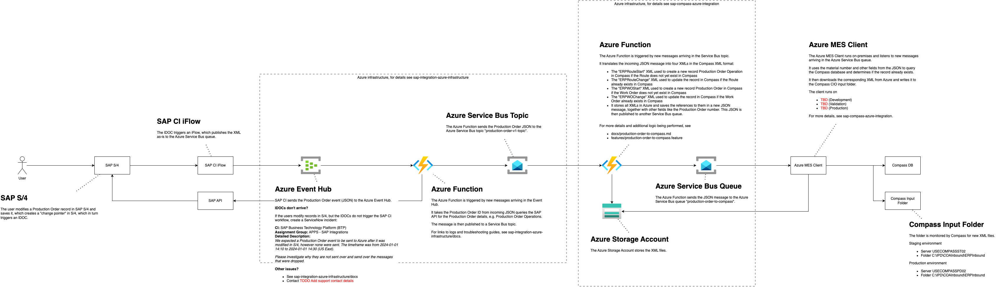

# Production Order to Compass

Feature spec is [features/production-order-to-compass.feature](../features/production-order-to-compass.feature).

The flow diagram [production-order-to-compass.png](./production-order-to-compass.png) file is an editable bitmap image and can be edited using DrawIO.



This integration relates to _IDD0610 Send Production Order to Azure-Manufacturing Execution_.


## SAP to Azure

SAP sends the Production Order event message (SAP JSON format) to the Azure resources provided by [sap-integration-azure-infrastructure](https://github.com/goreperformancesolution/sap-integration-azure-infrastructure). There, the Production Order payload is retrieved by calling SAP APIs and then published to the Azure Service Bus topic _production-order-v1-topic_. For more details about that part of the process, see [sap-integration-azure-infrastructure](https://github.com/goreperformancesolution/sap-integration-azure-infrastructure).

## Compass-specific logic in Azure

From there, the Azure resources provided by this repository continue processing the message. The Azure Function [_production-order-to-compass.ts_](../function-app/src/functions/production-order-to-compass.ts) listens to messages from Service Bus topic _production-order-v1-topic_ and performs the following steps:

1. Stops processing the message if it is not for a plant that uses Compass, see [function-app/src/conversions/plant.csv](../function-app/src/conversions/plant.csv)
1. Translate the message to XML files used to
   1. Create a new Production Order (Work Order) record
   1. Update an existing Production Order (Work Order) record
   1. Create a new Production Order Operation (Route) record
   1. Update an existing Production Order Operation (Route) record
1. Upload all XMLs to the Azure Storage Blob Container
1. Publish a message with references to the XMLs in the Azure Storage Blob Container to the Service Bus queue _production-order-to-compass_

All payloads are stored in Azure, the exact location for each Function invocation is printed in the logs. For more details, see [TROUBLESHOOTING.md](../TROUBLESHOOTING.md#accessing-payloads).

```log
[2024-10-18T12:51:33.794Z] Blob location is topic=production-order-to-compass/year=2024/month=10/day=18/mid=add70b2688164cddb27d84d9eddc13f8/
```

## Compass Azure Client

The _Compass Azure Client_ listens to messages from the Service Bus queue _production-order-to-compass_ and performs the following steps:

1. If production order does not exist, create the route first.
   1. If route exists, remove existing routing steps, send route update XML to Compass.
   1. If route does not exist, send route create XML to Compass.
   1. Check that route exists.
   1. Send production order create XML to Compass.
1. If production order exists, send production order update XML to Compass.
   1. If the production order is not started, remove existing routing steps, send route update XML to Compass.
   1. Check that route exists.
   1. Remove existing items, send item update XML to Compass.


Compass picks up the files and updates the Production Order and Production Order Operation records.

## Logs

See [TROUBLESHOOTING.md](../TROUBLESHOOTING.md) on how to access the logs.

## Updating the mapping

Follow the steps below to update the mapping from the incoming SAP message to the Compass XML file:

1. Document the change in [production-order-to-compass.xlsx](../features/production-order-to-compass.xlsx)
1. Add the mapped fields of the incoming `SAPMessage` in [production-order-to-compass.d.ts](../function-app/src/functions/sap-to-compass/production-order-to-compass.d.ts)

   The `SAPMessage` currently only contains the fields that are also currently mapped. You can see the entire SAP message with all available fields in the `input.json` file(s) in the Azure Blob Container `message-archive` under `topic=production-order-to-compass`.

1. Update the XML text with the new mapping(s) to create a new Production Order in Compass in the `getCreateProductionOrderXml(...)` method of [production-order-to-compass.ts](../function-app/src/functions/sap-to-compass/production-order-to-compass.ts)
1. Update the XML text with the new mapping(s) to update an existing Production Order in Compass in the `getUpdateProductionOrderXml(...)` method of [production-order-to-compass.ts](../function-app/src/functions/sap-to-compass/production-order-to-compass.ts)
1. Update the XML text with the new mapping(s) to create new Production Order Operations (Routes) in Compass in the `getCreateProductionOrderOperationsXml(...)` method of [production-order-to-compass.ts](../function-app/src/functions/sap-to-compass/production-order-to-compass.ts)
1. Update the XML text with the new mapping(s) to update existing Production Order Operations (Routes) in Compass in the `getUpdateProductionOrderOperationsXml(...)` method of [production-order-to-compass.ts](../function-app/src/functions/sap-to-compass/production-order-to-compass.ts)
1. Update the XML text with the new mapping(s) to create/update existing Production Order Components in Compass in the `getUpdateProductionOrderComponentsXml(...)` method of [production-order-to-compass.ts](../function-app/src/functions/sap-to-compass/production-order-to-compass.ts)
1. Update the expected test results in the [expected-\*.xml](../function-app/test/sap-to-compass/production-order-to-compass) files
