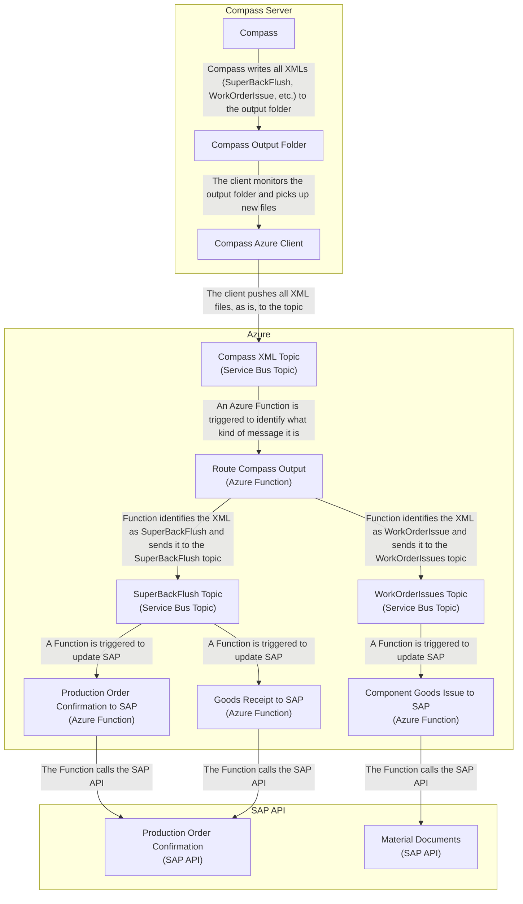

# Route outgoing Compass XMLs

This page explains how the XMLs that are sent out from Compass are routed to their destinations, e.g. to send _SuperBackFlush_ XMLs to the _Production Order Confirmation_ SAP API.

It does not explain the specifics of each integration, but rather how the routing is handled and where future integrations can subscribe to those outgoing Compass XML messages.

For the details on the individual integrations, see

- [Goods Receipt to SAP](./goods-receipt-to-sap.md)
- [Production Order Confirmation to SAP](./production-order-confirmation-to-sap.md)
- [Component Goods Issue to SAP](./components-goods-issues-to-sap.md)

## Compass Azure Client

Compass writes its output files to the following location:

- `\\usecompassst02.wlgore.com\c$\IPD\COAOutbound\Log\WriteRequests` (DEV)
- TBD (VAL)
- TBD (PRD)

The [_Compass Azure Client_](../SAP2COMPASS/COMPASS2SAP_Main_Service) monitors the Compass output folder for new XML files and publishes them to the `compass-output-xml` Azure Service Bus topic.

- [Azure ServiceBus `compass-output-xml` topic (DEV)](https://portal.azure.com/#@wlgore.onmicrosoft.com/resource/subscriptions/e2fda199-cfde-4565-9bb3-08b676d05cc2/resourceGroups/rg-arb-406c7858f033cd27c6cf5c3530980ecd50d70417/providers/Microsoft.ServiceBus/namespaces/sbn-uivtxalxpuii2/topics/compass-output-xml/explorer)
- [Azure ServiceBus `compass-output-xml` topic (VAL)](https://portal.azure.com/#@wlgore.onmicrosoft.com/resource/subscriptions/e2fda199-cfde-4565-9bb3-08b676d05cc2/resourceGroups/rg-arb-6592bc8064206952043ec5110cdc8bf25ff1489b/providers/Microsoft.ServiceBus/namespaces/sbn-k7nqx5nlh6fcs/topics/compass-output-xml/explorer)
- Azure ServiceBus `compass-output-xml` topic (PRD)

## Routing the XML in Azure

From there, the [route-compass-output](../function-app/src/functions/compass-to-sap/route-compass-output.ts) Azure Function receives the file, marks the file as "in process" in the Compass transaction manager, and determines what kind of Compass XML message it is.

- [Topic subscription for the `route-compass-output` Function (DEV)](https://portal.azure.com/#@wlgore.onmicrosoft.com/resource/subscriptions/e2fda199-cfde-4565-9bb3-08b676d05cc2/resourceGroups/rg-arb-406c7858f033cd27c6cf5c3530980ecd50d70417/providers/Microsoft.ServiceBus/namespaces/sbn-uivtxalxpuii2/topics/compass-output-xml/subscriptions/route-compass-output-function/explorer)
- [Topic subscription for the `route-compass-output` Function (VAL)](https://portal.azure.com/#@wlgore.onmicrosoft.com/resource/subscriptions/e2fda199-cfde-4565-9bb3-08b676d05cc2/resourceGroups/rg-arb-6592bc8064206952043ec5110cdc8bf25ff1489b/providers/Microsoft.ServiceBus/namespaces/sbn-k7nqx5nlh6fcs/topics/compass-output-xml/subscriptions/route-compass-output-function/explorer)
- Topic subscription for the `route-compass-output` Function (PRD)

For example, _SuperBackFlush_ messages are identified by a `<MessageType>` of `SuperBackFlush` and then sent to the `superbackflush-from-compass-v1` and `superbackflush-from-compass-v2` Azure topics.

From there, other Functions can consume the Compass messages and perform integration-specific logic. An example for such a Function is the Azure Function [`production-order-confirmation-to-sap`](../function-app/src/functions/compass-to-sap/production-order-confirmation-to-sap.ts).

The following Compass messages are available

- `superbackflush-from-compass-v1` (original Compass XML)
  - [Topic subscriptions](https://portal.azure.com/#@wlgore.onmicrosoft.com/resource/subscriptions/e2fda199-cfde-4565-9bb3-08b676d05cc2/resourceGroups/rg-arb-406c7858f033cd27c6cf5c3530980ecd50d70417/providers/Microsoft.ServiceBus/namespaces/sbn-uivtxalxpuii2/topics/superbackflush-from-compass-v1/subscriptions) (DEV)
  - [Topic subscriptions](https://portal.azure.com/#@wlgore.onmicrosoft.com/resource/subscriptions/e2fda199-cfde-4565-9bb3-08b676d05cc2/resourceGroups/rg-arb-6592bc8064206952043ec5110cdc8bf25ff1489b/providers/Microsoft.ServiceBus/namespaces/sbn-k7nqx5nlh6fcs/topics/superbackflush-from-compass-v1/subscriptions) (VAL)
  - Topic subscriptions (PRD)
- `superbackflush-from-compass-v2` (JSON-version of the original Compass XML)
  - [Topic subscriptions](https://portal.azure.com/#@wlgore.onmicrosoft.com/resource/subscriptions/e2fda199-cfde-4565-9bb3-08b676d05cc2/resourceGroups/rg-arb-406c7858f033cd27c6cf5c3530980ecd50d70417/providers/Microsoft.ServiceBus/namespaces/sbn-uivtxalxpuii2/topics/superbackflush-from-compass-v2/subscriptions) (DEV)
  - [Topic subscriptions](https://portal.azure.com/#@wlgore.onmicrosoft.com/resource/subscriptions/e2fda199-cfde-4565-9bb3-08b676d05cc2/resourceGroups/rg-arb-6592bc8064206952043ec5110cdc8bf25ff1489b/providers/Microsoft.ServiceBus/namespaces/sbn-k7nqx5nlh6fcs/topics/superbackflush-from-compass-v2/subscriptions) (VAL)
  - Topic subscriptions (PRD)
- `workorderissues-from-compass-v1` (original Compass XML)
  - [Topic subscriptions](https://portal.azure.com/#@wlgore.onmicrosoft.com/resource/subscriptions/e2fda199-cfde-4565-9bb3-08b676d05cc2/resourceGroups/rg-arb-406c7858f033cd27c6cf5c3530980ecd50d70417/providers/Microsoft.ServiceBus/namespaces/sbn-uivtxalxpuii2/topics/workorderissues-from-compass-v1/subscriptions) (DEV)
  - [Topic subscriptions](https://portal.azure.com/#@wlgore.onmicrosoft.com/resource/subscriptions/e2fda199-cfde-4565-9bb3-08b676d05cc2/resourceGroups/rg-arb-6592bc8064206952043ec5110cdc8bf25ff1489b/providers/Microsoft.ServiceBus/namespaces/sbn-k7nqx5nlh6fcs/topics/workorderissues-from-compass-v1/subscriptions) (VAL)
  - Topic subscriptions (PRD)
- `workorderissues-from-compass-v2` (JSON-version of the original Compass XML)
  - [Topic subscriptions](https://portal.azure.com/#@wlgore.onmicrosoft.com/resource/subscriptions/e2fda199-cfde-4565-9bb3-08b676d05cc2/resourceGroups/rg-arb-406c7858f033cd27c6cf5c3530980ecd50d70417/providers/Microsoft.ServiceBus/namespaces/sbn-uivtxalxpuii2/topics/workorderissues-from-compass-v2/subscriptions) (DEV)
  - [Topic subscriptions](https://portal.azure.com/#@wlgore.onmicrosoft.com/resource/subscriptions/e2fda199-cfde-4565-9bb3-08b676d05cc2/resourceGroups/rg-arb-6592bc8064206952043ec5110cdc8bf25ff1489b/providers/Microsoft.ServiceBus/namespaces/sbn-k7nqx5nlh6fcs/topics/workorderissues-from-compass-v2/subscriptions) (VAL)
  - Topic subscriptions (PRD)

## Dataflow

## Logs

See [TROUBLESHOOTING.MD](../TROUBLESHOOTING.md#accessing-the-logs).
