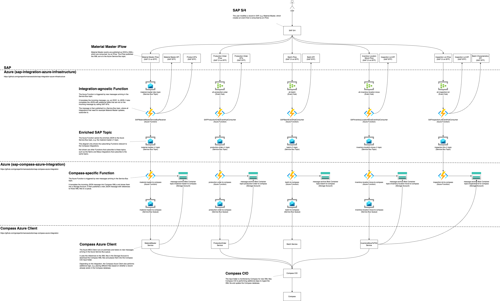

# SAP to Compass Integrations

This page explains how SAP data is published outside of SAP and routed down to Compass, e.g. to send an update to a _Material Master_ record to Compass as an XML file.

It does not explain the specifics of each integration, but rather how the routing is handled.

For the details on the individual integrations, see

- [Inspection Lot to Compass](./inspection-lot-to-compass.md)
- [Inventory Location Move to Compass](./inventory-location-move-to-compass.md)
- [Material Master to Compass](./material-master-to-compass.md)
- [Production Order to Compass](./production-order-to-compass.md)

## Dataflow

The flow diagram [sap-to-compass-integrations.png](./sap-to-compass-integrations.png) file is an editable bitmap image and can be edited using DrawIO.

## SAP Integration Azure Infrastructure

The [goreperformancesolution/sap-integration-azure-infrastructure](https://github.com/goreperformancesolution/sap-integration-azure-infrastructure) repository contains the Azure infrastructure to receive messages from SAP and process them, e.g. to enrich them with additional data retrieved from SAP API calls and provide them to downstream integrations.

This page does not go into the details of each message received from SAP, but rather how the routing is handled and how the SAP-Compass-integrations of this repository consume them.

## Compass Azure Client

The [Compass Azure Client](./SAP2COMPASS) consumes messages from the Azure Service Bus queues and writes the XML files to the Compass input folder. For more details, see [Azure MES Client Deployment](./azure-mes-client-deployment.md).
